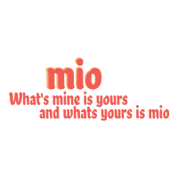

### `Assignment` ###
Pursuit (https://github.com/mmosayed/PCNW-Portfolio-Projects)

### `Resources` ###
Color Schemes (https://coolors.co/)  
FreeLogo Design (https://www.freelogodesign.org/)  
Google Fonts (https://fonts.google.com/)  
Transparent Textures(https://www.transparenttextures.com/)

### `Project Management` ###
Trello (https://trello.com/b/ho6MYxja/mio)  

### `Page Format` ###
Font -  Chela One  
-Added Lato  
Font Color - #F25C54  
Body Background Color - #F7B267  
-Updated to White  
Nav/Footer Background Color - #F79D65  
Links Color - #F27059  
